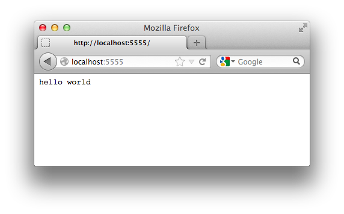

Getting started
===============

Hello world
-----------

The following small code shows you how to print "hello world" using Plastic
web framework::

    from plastic.app import BaseApp

    App = BaseApp.clone()

    @App.route('/')
    def hello(request):
        return 'Hello, world!'

    if __name__ == '__main__':
        App().run()

Save the script (say it's :file:`hello.py`) and execute it:

.. sourcecode:: console

   $ python hello.py
    * Running on http://127.0.0.1:5555/
    * Restarting with reloader

Then open http://127.0.0.1:5555/ in your favorite web browser.  The page
says you "Hello, world!":

